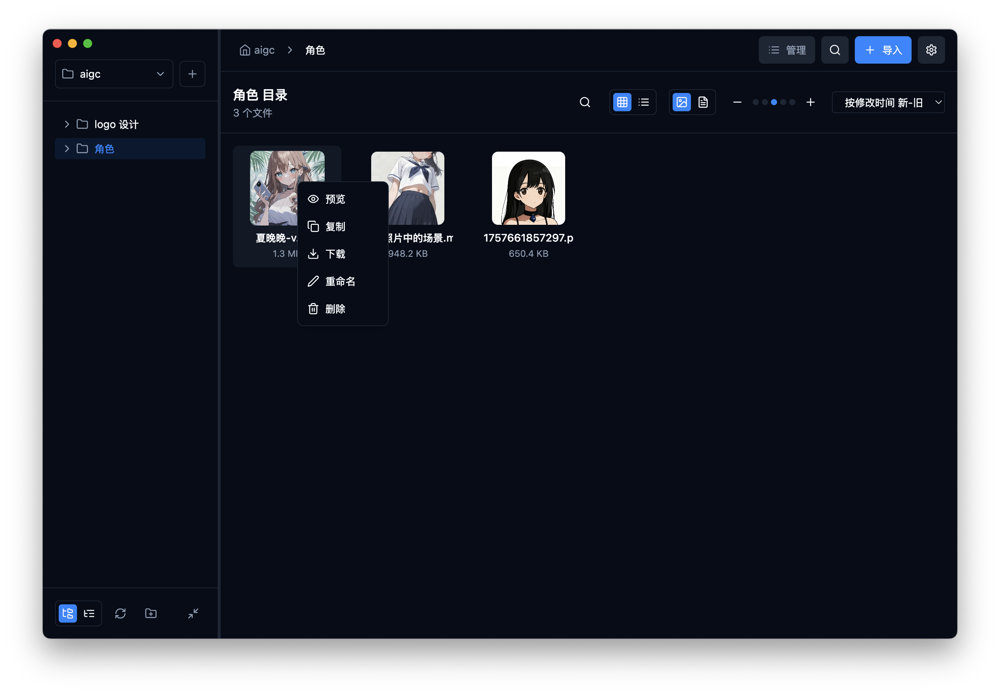
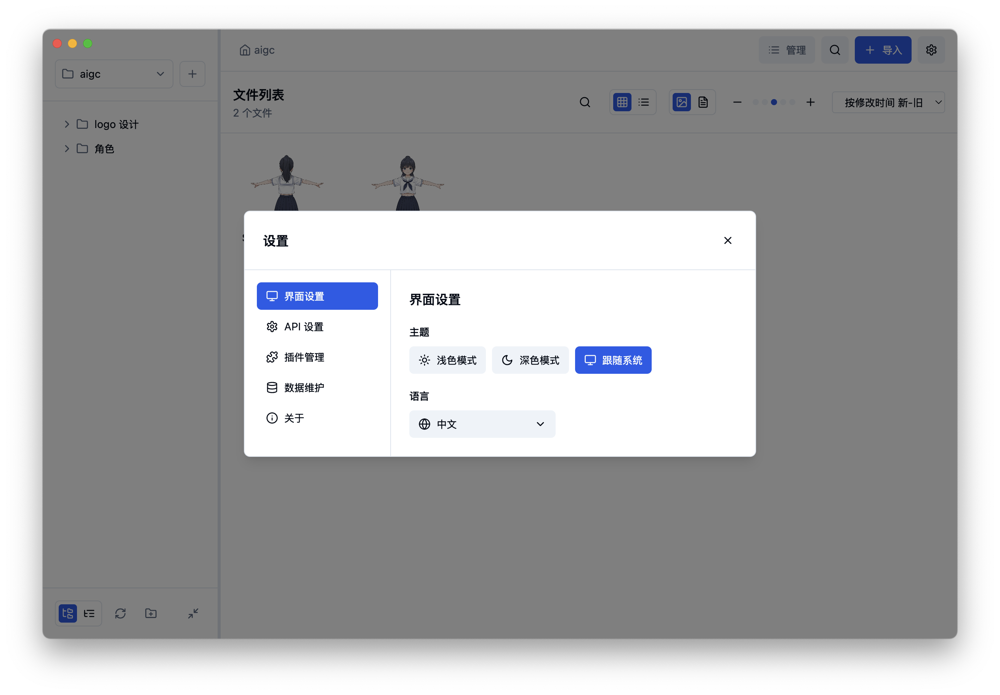
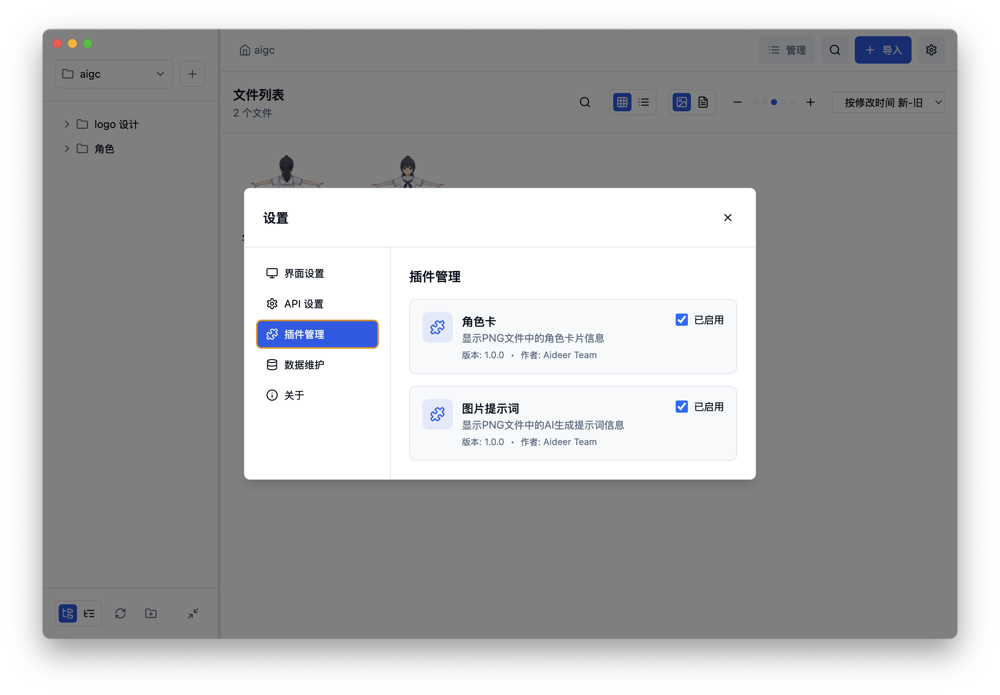
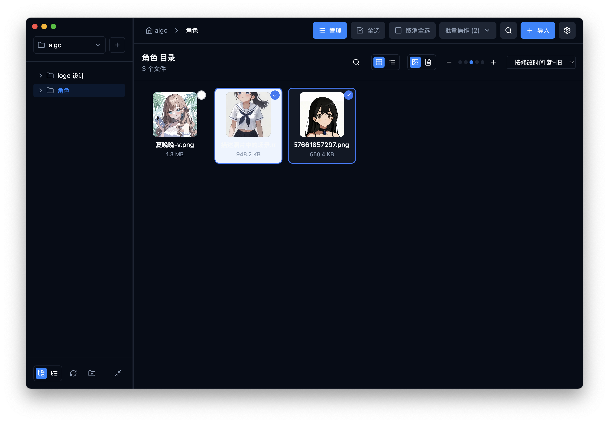

# AiDeer

[中文文档](README_zh.md) | English

AiDeer is a professional AI asset management tool that helps you collect, organize, and manage AI-generated content from various image and video generation websites. Keep your AI creative assets organized and ready to use.

[](https://www.gnu.org/licenses/agpl-3.0)
[](https://github.com/easychen/aideer)

## Screenshots

<div align="center">

### Main Interface

*File browser interface with multi-level tree directory, customizable preview size, and quick copy functionality*

### Settings & Plugin Management
<table>
  <tr>
    <td></td>
    <td></td>
  </tr>
  <tr>
    <td align="center"><em>Settings with light/dark theme support</em></td>
    <td align="center"><em>Open plugin architecture</em></td>
  </tr>
</table>

### Batch Operations & File Details
<table>
  <tr>
    <td></td>
    <td></td>
  </tr>
  <tr>
    <td align="center"><em>Multi-selection batch operations</em></td>
    <td align="center"><em>File details with tags and notes</em></td>
  </tr>
</table>

</div>

## Features

### 🌐 Multi-Platform Collection
Browser extension for image import, drag-and-drop batch file import, easily collect AI-generated content from various platforms

### 💡 Prompt Management
View image prompt information, easily manage and reuse your creative inspiration

### 🎭 Character Card Management
View and manage CharacterCard information, unified management of your AI character assets

### 🚀 Flexible Deployment
Support self-hosted private deployment or use as client, meeting different scenario needs

### 🔍 Quick Search & Locate
Powerful search functionality, support multi-dimensional quick asset location by filename, tags, prompts

### 📦 Batch Import Management
Support batch file import and operations, improve asset management efficiency, save valuable time

### 🔌 Plugin Extension System
Dynamic plugin loading based on file extensions, support custom processing logic, highly extensible

### 🏷️ Smart Annotation System
File hash-based notes and tag system, ensuring annotation information never gets lost

### 💝 Open Source & Free
Completely open source and free, AGPL-3.0 license, community-driven development, continuous improvement

## Getting Started

### Download Options

#### Desktop Applications
[WebSite](https://ad.level06.com/)

#### Docker Deployment

**Quick Start:**
```bash
# Pull and run AiDeer
docker run -d \
  --name aideer \
  -p 3001:3001 \
  -v aideer_data:/app/data \
  --restart unless-stopped \
  easychen/aideer:latest
```

**Docker Compose:**
```yaml
version: '3.8'
services:
  aideer:
    image: easychen/aideer:latest
    ports:
      - "3001:3001"
    volumes:
      - aideer_data:/app/data
    restart: unless-stopped

volumes:
  aideer_data:
```

### Prerequisites

- Node.js 18+ (for local development)
- Docker and Docker Compose (for containerized deployment)

### Development Setup

1. Clone the repository
```bash
git clone https://github.com/easychen/aideer.git
cd aideer
```

2. Install dependencies
```bash
# Install root dependencies
npm install

# Install frontend dependencies
cd frontend && npm install

# Install backend dependencies
cd ../backend && npm install
```

3. Start development servers
```bash
# Start frontend (port 3000)
cd frontend && npm run dev

# Start backend (port 3001)
cd backend && npm run dev
```

### Docker Deployment

AiDeer supports two Docker deployment methods:

#### Method 1: Using Docker Commands

1. **Build the application:**
   ```bash
   # Using Robo task runner
   ./robo build-docker
   
   # Or manually
   cd frontend && npm run build
   cd ../backend && npm run build
   docker build -t aideer:latest -f docker/Dockerfile .
   ```

2. **Run the container:**
   ```bash
   docker run -d \
     --name aideer \
     -p 3001:3001 \
     -v aideer_data:/app/data \
     --restart unless-stopped \
     aideer:latest
   ```

3. **Access the application:**
   Open your browser and navigate to `http://localhost:3001`

#### Method 2: Using Docker Compose (Recommended)

1. **Start the application:**
   ```bash
   docker-compose up -d
   ```

2. **Stop the application:**
   ```bash
   docker-compose down
   ```

3. **View logs:**
   ```bash
   docker-compose logs -f aideer
   ```

4. **Update the application:**
   ```bash
   docker-compose pull
   docker-compose up -d
   ```

### Docker Hub Deployment

To publish to Docker Hub:

1. **Build and publish:**
   ```bash
   # Using Robo task runner
   ./robo publish-docker [tag]
   
   # Or manually
   docker tag aideer:latest your-dockerhub-username/aideer:latest
   docker push your-dockerhub-username/aideer:latest
   ```

2. **Pull and run from Docker Hub:**
   ```bash
   docker pull your-dockerhub-username/aideer:latest
   docker run -d -p 3001:3001 your-dockerhub-username/aideer:latest
   ```

### Environment Variables

- `NODE_ENV`: Set to `production` for production deployment
- `PORT`: Application port (default: 3001)

### Health Check

The application includes a health check endpoint at `/health` that can be used for monitoring and load balancer configuration.

## Contributing

We welcome contributions to AiDeer! Please read our [Contributing Guidelines](CONTRIBUTING.md) before submitting pull requests.

### Contributor License Agreement (CLA)

All contributors must sign our [Contributor License Agreement (CLA)](CLA.md) before their contributions can be merged. This helps ensure that the project can remain open source.

### Development Guidelines

1. Fork the repository
2. Create a feature branch
3. Make your changes
4. Add tests if applicable
5. Ensure all tests pass
6. Submit a pull request

## License

This project is licensed under the GNU Affero General Public License v3.0 (AGPL-3.0) - see the [LICENSE](LICENSE) file for details.

The AGPL-3.0 license ensures that:
- The software remains free and open source
- Any modifications or derivative works must also be open source
- Network use of the software requires providing source code to users

## Support

- 📖 [Documentation](https://github.com/easychen/aideer/wiki)
- 🐛 [Issue Tracker](https://github.com/easychen/aideer/issues)
- 💬 [Discussions](https://github.com/easychen/aideer/discussions)

## Authors

- **easychen** - *Initial work* - [easychen](https://github.com/easychen)

## Acknowledgments

- Thanks to all contributors who have helped improve this project
- Built with modern web technologies and AI capabilities
