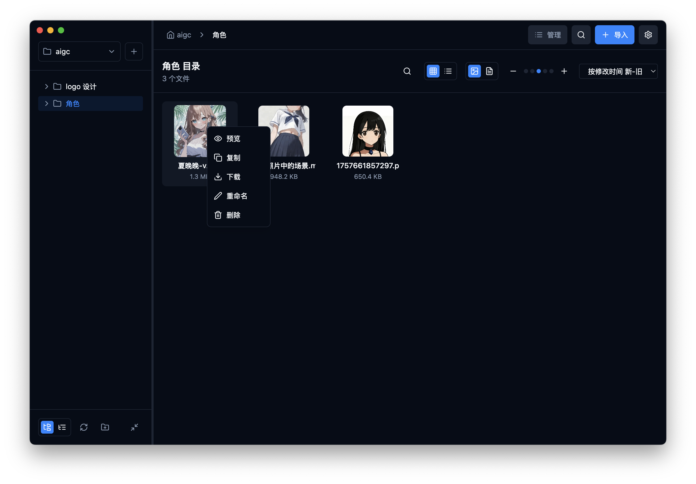
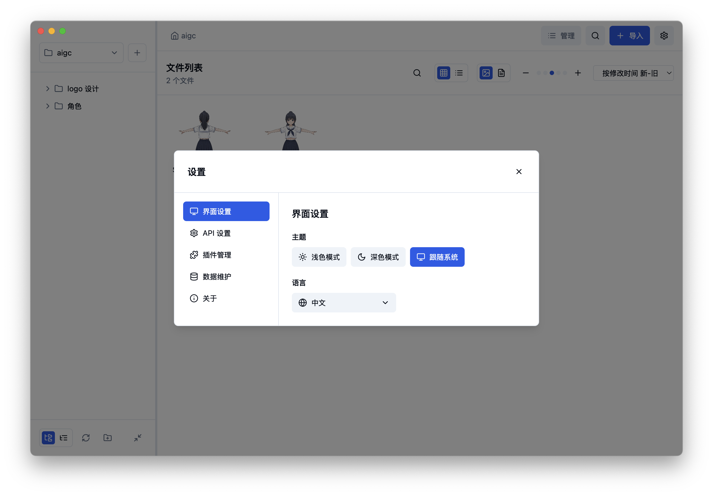
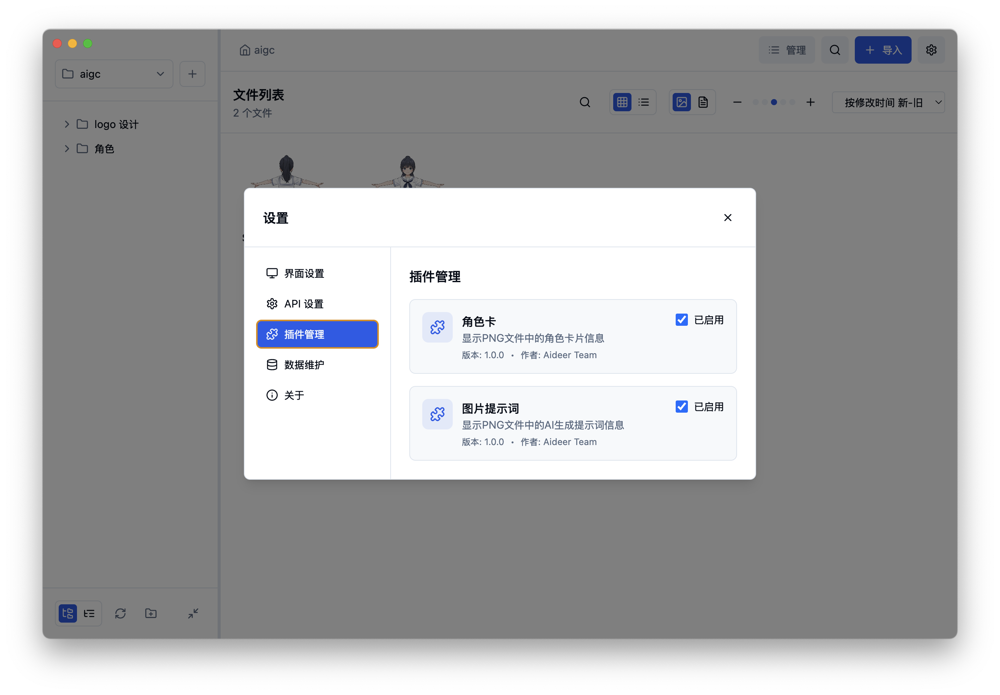
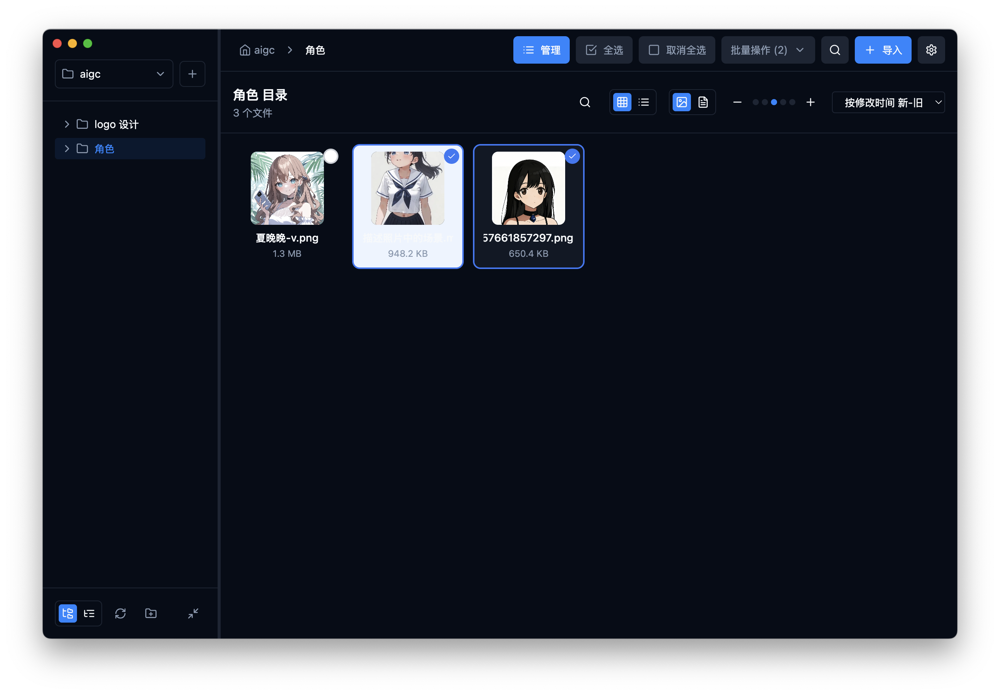
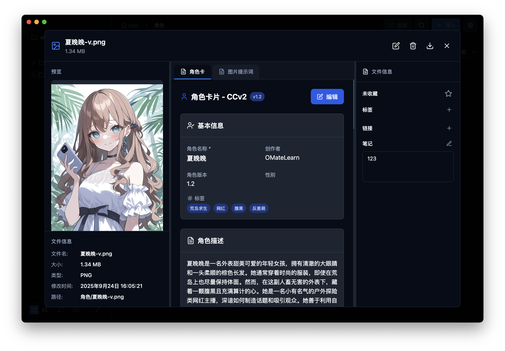

# AiDeer

中文文档 | [English](README.md)

AiDeer 是一款专业的 AI 资产管理工具，帮助你统一收集、整理和管理来自各个生图、生视频网站的 AI 创作内容。让你的 AI 创作资产井然有序，随时可用。

[](https://www.gnu.org/licenses/agpl-3.0)
[](https://github.com/easychen/aideer)

## 界面截图

<div align="center">

### 主界面

*文件浏览界面，支持多级树状目录、可自定义预览图大小、鼠标滑动预览视频，快速复制图片内容*

### 设置与插件管理
<table>
  <tr>
    <td></td>
    <td></td>
  </tr>
  <tr>
    <td align="center"><em>支持明暗主题、多语言切换</em></td>
    <td align="center"><em>开放的插件结构</em></td>
  </tr>
</table>

### 批量操作与文件详情
<table>
  <tr>
    <td></td>
    <td></td>
  </tr>
  <tr>
    <td align="center"><em>支持多选，对选中项进行批量删除、复制、移动等操作</em></td>
    <td align="center"><em>文件详情，支持添加标签、链接和笔记</em></td>
  </tr>
</table>

</div>

## 功能特色

### 🌐 多平台收集
浏览器插件导入图片、拖动导入批量文件，轻松收集各平台 AI 生成内容

### 💡 提示词管理
查看图片提示词信息，轻松管理和复用你的创作灵感

### 🎭 角色卡管理
查看和管理 CharacterCard 的角色卡信息，统一管理你的 AI 角色资产

### 🚀 灵活部署方式
支持 Self-hosted 私有部署，也可作为客户端使用，满足不同场景需求

### 🔍 快速搜索定位
强大的搜索功能，支持按文件名、标签、提示词等多维度快速定位资产

### 📦 批量导入管理
支持批量导入文件和批量操作，提高资产管理效率，节省宝贵时间

### 🔌 插件扩展系统
基于文件扩展名动态加载插件，支持自定义处理逻辑，扩展性强

### 🏷️ 智能标注系统
基于文件 Hash 的笔记和标签系统，确保标注信息永不丢失

### 💝 开源免费
完全开源免费，AGPL-3.0 许可证，社区驱动开发，持续改进优化

## 快速开始

### 下载选项

#### 桌面应用程序
[WebSite](https://ad.level06.com/)

#### Docker 部署

**快速启动：**
```bash
# 拉取并运行 AiDeer
docker run -d \
  --name aideer \
  -p 3001:3001 \
  -v aideer_data:/app/data \
  --restart unless-stopped \
  easychen/aideer:latest
```

**Docker Compose：**
```yaml
version: '3.8'
services:
  aideer:
    image: easychen/aideer:latest
    ports:
      - "3001:3001"
    volumes:
      - aideer_data:/app/data
    restart: unless-stopped

volumes:
  aideer_data:
```

### 环境要求

- Node.js 18+ (本地开发)
- Docker 和 Docker Compose (容器化部署)

### 开发环境搭建

1. 克隆仓库
```bash
git clone https://github.com/easychen/aideer.git
cd aideer
```

2. 安装依赖
```bash
# 安装根目录依赖
npm install

# 安装前端依赖
cd frontend && npm install

# 安装后端依赖
cd ../backend && npm install
```

3. 启动开发服务器
```bash
# 启动前端 (端口 3000)
cd frontend && npm run dev

# 启动后端 (端口 3001)
cd backend && npm run dev
```

### Docker 部署

AiDeer 支持两种 Docker 部署方式：

#### 方式一：使用 Docker 命令

1. **构建应用：**
   ```bash
   # 使用 Robo 任务运行器
   ./robo build-docker
   
   # 或手动构建
   cd frontend && npm run build
   cd ../backend && npm run build
   docker build -t aideer:latest -f docker/Dockerfile .
   ```

2. **运行容器：**
   ```bash
   docker run -d \
     --name aideer \
     -p 3001:3001 \
     -v aideer_data:/app/data \
     --restart unless-stopped \
     aideer:latest
   ```

3. **访问应用：**
   打开浏览器访问 `http://localhost:3001`

#### 方式二：使用 Docker Compose（推荐）

1. **启动应用：**
   ```bash
   docker-compose up -d
   ```

2. **停止应用：**
   ```bash
   docker-compose down
   ```

3. **查看日志：**
   ```bash
   docker-compose logs -f aideer
   ```

4. **更新应用：**
   ```bash
   docker-compose pull
   docker-compose up -d
   ```

### Docker Hub 部署

发布到 Docker Hub：

1. **构建并发布：**
   ```bash
   # 使用 Robo 任务运行器
   ./robo publish-docker [tag]
   
   # 或手动操作
   docker tag aideer:latest your-dockerhub-username/aideer:latest
   docker push your-dockerhub-username/aideer:latest
   ```

2. **从 Docker Hub 拉取并运行：**
   ```bash
   docker pull your-dockerhub-username/aideer:latest
   docker run -d -p 3001:3001 your-dockerhub-username/aideer:latest
   ```

### 环境变量

- `NODE_ENV`: 生产环境设置为 `production`
- `PORT`: 应用端口 (默认: 3001)

### 健康检查

应用包含健康检查端点 `/health`，可用于监控和负载均衡器配置。

## 贡献

我们欢迎对 AiDeer 的贡献！请在提交 pull request 之前阅读我们的[贡献指南](CONTRIBUTING.md)。

### 贡献者许可协议 (CLA)

所有贡献者必须在其贡献被合并之前签署我们的[贡献者许可协议 (CLA)](CLA.md)。这有助于确保项目能够保持开源。

### 开发指南

1. Fork 仓库
2. 创建功能分支
3. 进行更改
4. 如适用，添加测试
5. 确保所有测试通过
6. 提交 pull request

## 许可证

本项目采用 GNU Affero General Public License v3.0 (AGPL-3.0) 许可证 - 详见 [LICENSE](LICENSE) 文件。

AGPL-3.0 许可证确保：
- 软件保持自由和开源
- 任何修改或衍生作品也必须开源
- 网络使用软件需要向用户提供源代码

## 支持

- 📖 [文档](https://github.com/easychen/aideer/wiki)
- 🐛 [问题跟踪](https://github.com/easychen/aideer/issues)
- 💬 [讨论](https://github.com/easychen/aideer/discussions)

## 作者

- **easychen** - *初始工作* - [easychen](https://github.com/easychen)

## 致谢

- 感谢所有帮助改进此项目的贡献者
- 使用现代 Web 技术和 AI 能力构建